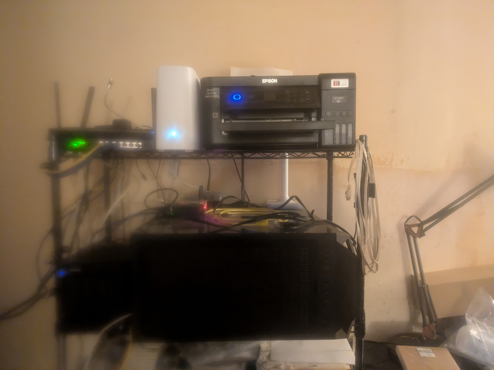

I've spent the last while building out a homelab that now runs everything from DNS to a Minecraft server to a
TTRPG app I'm developing myself. This post is a snapshot of where it stands today — the physical hardware, how
it's organized, and the services running on top of it.

## Table of contents

## The hardware

Everything runs on a single physical box: a Proxmox VE host doing the actual virtualization, sitting on a shelf
next to the router, switch, a NAS enclosure, and a printer that has nothing to do with any of this but lives on
the same shelf anyway.

*The actual rack — router and switch on top, Proxmox host on the bottom.*

Nothing fancy, no rackmount gear, no IPMI — just consumer hardware doing real work.

## Virtualization strategy

Rather than running every service as a container side-by-side on one OS, I split things into **one VM per
service group** on top of Proxmox. Each VM gets its own Docker install and its own Portainer-managed stack, so
a problem in one group (say, the download stack) can't take out something unrelated (say, DNS). Roughly a
dozen VMs currently, covering:

- **Infrastructure** — reverse proxies and the dashboard that ties everything together
- **DNS** — two VMs, each running Pi-hole, for redundancy
- **Media** — Plex (with GPU passthrough for transcoding), Ombi, Kavita, Audiobookshelf
- **Matrix** — a self-hosted Synapse homeserver + Element client for chat
- **Community services** — a wiki, a forum, a Minecraft server, all serving a small community I run alongside
  my own personal services
- **Storage** — a dedicated VM exporting media storage over SSHFS to whatever else needs it

That per-group isolation is a deliberate trade: it costs more RAM/disk overhead than cramming everything into
one Docker host, but it means blast radius stays small when something breaks, and each VM can be rebuilt or
restored independently.

## Networking and access

Two Nginx Proxy Manager instances handle all reverse proxying and TLS termination, one per domain I run:
a personal/admin domain and a community domain for the people I share services with. Both request wildcard
certificates from Let's Encrypt via DNS-01 challenges against Cloudflare's API, so every subdomain gets HTTPS
without hand-issuing a cert per service.

DNS-level ad-blocking runs through two independent Pi-hole instances rather than one, so a single Pi-hole
outage doesn't take down name resolution for the whole network.

Everything that doesn't need to be public-facing — admin tools, anything with a history of being targeted
when exposed directly to the internet — stays reachable only over a private VPN mesh rather than getting a
public DNS entry at all. Only things that genuinely need to be reachable by anonymous visitors
or embedded/locked-down client devices (smart TVs, game consoles) get exposed publicly.

## Keeping track of it all

With this many moving pieces, "what runs where" stops being obvious from memory alone. Two things make that
tractable:

- A **homepage** dashboard aggregating every service into one page, with live health checks and widgets
  pulling status from Portainer and Proxmox directly.
- A **documentation repo**, versioned in git, recording every VM, every service's config, and every
  troubleshooting session — so six months from now I can find out why a given port or mount path is set up
  the way it is, instead of re-deriving it from scratch.

## What's running on it

At this point the homelab hosts, among other things: a Minecraft server (with its own control panel), a phpBB
forum, a wiki, a Matrix chat homeserver, a full media stack (acquisition, organization, and playback), photo
hosting, a federated social network node, household inventory tracking, calendar/contacts sync, and a TTRPG
playtest web app I'm building myself. This blog is the newest addition — running as just another container
in that same stack.

## What's next

This is very much a living system. Future posts here will cover specific builds as they happen — new
hardware, service migrations, and the troubleshooting that inevitably comes with running all of this on
hardware I bought myself and diagnose myself when it breaks.
