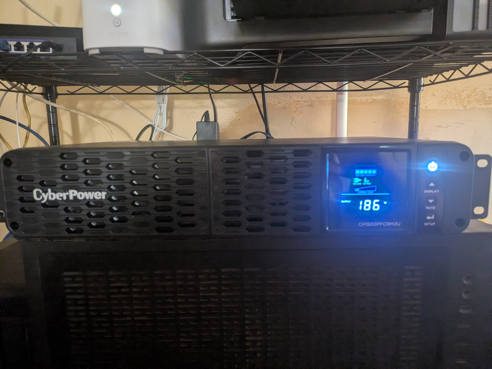

A rack UPS finally landed on the shelf — a CyberPower 1500VA/1000W unit powering the Proxmox host plus the
router and switch. A UPS that just sits there quietly running on battery when the power blips isn't that
useful on its own; the interesting part is having the server actually *know* when it's on battery, and shut
itself down cleanly before the battery runs out instead of just dying mid-write.

*My UPS*

## Table of contents

## The plan vs. the holdover

The long-term plan is to put UPS monitoring on its own tiny dedicated box — a Raspberry Pi that does nothing
but run the NUT (Network UPS Tools) master and watch the UPS over USB. The reasoning: if the UPS's USB cable
plugs into the same machine it's protecting, and that machine locks up or crashes for an unrelated reason,
the one thing you actually needed — a clean shutdown signal before the battery dies — goes down with it. A
separate always-on, dead-simple device sidesteps that entirely.

It's also part of a broader pattern: small appliance-like jobs like this one are moving off the main Proxmox
box and onto their own dedicated Pis over time, so the homelab can keep growing without piling more and more
unrelated responsibilities onto a single machine.

That Pi hasn't arrived yet. Rather than leave the UPS unmonitored in the meantime, I set it up as a temporary
standalone install directly on the Proxmox host — worse than the eventual setup, but much better than
nothing. When the Pi shows up, the USB cable moves over to it and the host switches from running its own NUT
server to just being a network client of the Pi's.

## Getting NUT talking to the UPS

NUT splits into three pieces that normally run together on one box in a standalone setup:

- A **driver** that speaks the UPS's actual protocol (USB HID, in this case) and translates it into NUT's
  internal format.
- **`upsd`**, a small data server that holds the current UPS state and answers queries from clients.
- **`upsmon`**, the monitor — polls `upsd`, and when battery charge or estimated runtime crosses a
  configured threshold, runs a shutdown command.

Installing the Linux distro's `nut` package and running its bundled scanner tool against the USB bus was
enough to auto-detect the UPS's vendor/product ID and confirm the exact model — handy, since the generic
descriptor string reported by a plain `lsusb` didn't actually match the model printed on the unit's own front
panel (turned out to just be a shared USB ID CyberPower reuses across several models in the same product
line, not a wrong label).

From there it's three small config files: which USB device to drive, which local address `upsd` should
listen on, and a `upsmon` account with a password to authenticate against it. Enable the driver, `upsd`, and
`upsmon` as services, and `upsc <upsname>` should start returning live numbers — battery percentage,
estimated runtime, current load, input/output voltage.

## The gotcha: udev rules don't apply retroactively

The driver refused to start at first, failing with a permissions error trying to open the USB device — odd,
since the package ships a udev rule that's supposed to hand that exact device over to the right group
automatically. Turned out the UPS had been plugged in *before* the NUT package (and its udev rule) was
installed, and udev only fires rules on a device event — plugging in, unplugging, or an explicit re-trigger —
not retroactively against a device that's already sitting there enumerated with old permissions.

The fix was a single command to manually re-fire udev against the already-connected device, rather than
needing a physical unplug/replug or a reboot. Worth knowing as a general udev fact, not just a NUT one: any
time a freshly installed package's udev rule doesn't seem to be taking effect on hardware that was already
plugged in when you installed it, that's the first thing to check.

## What's next

Once the dedicated Pi arrives, this setup graduates from "workable holdover" to "actually resilient" —
monitoring that survives a host crash instead of going down with it. Until then, the host protects itself,
which is still a meaningful upgrade from a UPS that just sits there being trusted to work.
